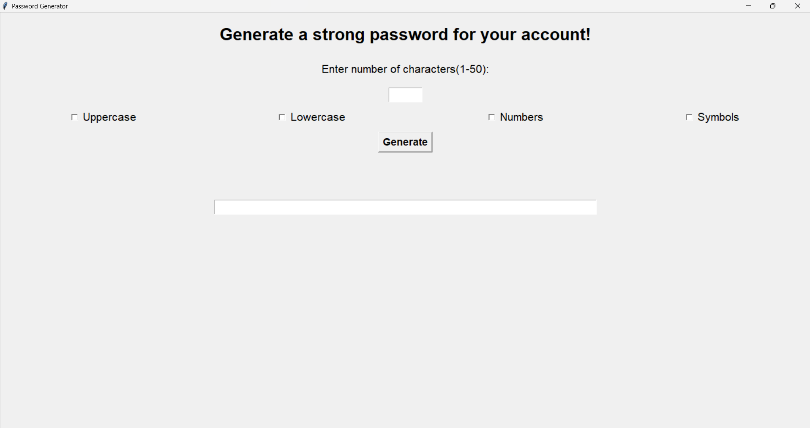
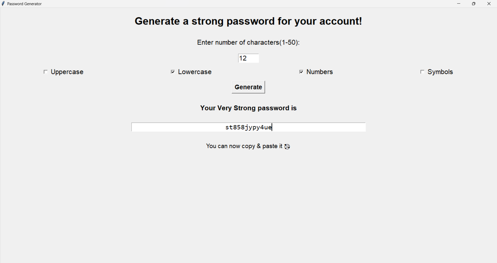

# 🔐 Password Generator (GUI-Based)

A simple yet powerful password generator built with Python and Tkinter. Customize your password with uppercase, lowercase, numbers, and symbols — all in a clean, user-friendly interface. Ideal for creating strong passwords on the go!

---

## 🚀 Features

- 📏 Choose password length (1 to 50 characters)
- 🔤 Select character types:
  - ✅ Uppercase letters
  - ✅ Lowercase letters
  - ✅ Numbers
  - ✅ Symbols
- 🎖️ View password strength rating
- ⚙️ Password appears in a copyable text field
- 📱 Clean and responsive GUI using Tkinter

---

## 🖼️ Demo




---

## 🛠️ Tech Stack

- **Language:** Python 3
- **GUI Library:** Tkinter
- **Modules Used:**
  - `string`
  - `random`
  - `tkinter`
  - `tkinter.messagebox`

---

## 📦 How to Run

1. Clone the repository:
   ```bash
   git clone https://github.com/AitijhyaCoded/Password-Generator.git
   cd Password-Generator
   ```

2. Run the script:
   ```bash
   python pwd-generator-tkr.py
   ```

---

## 📝 Usage

1. Enter desired password length (e.g., 12)
2. Select the checkboxes for character types you want
3. Click **Generate**
4. Copy the password from the entry field and use it anywhere!

---

## 💡 Future Ideas

- Add "Copy to Clipboard" button
- Allow saving password history 
- Improve Design

---

## 🤝 Contributing

Contributions are welcome! Feel free to open issues or submit pull requests to improve functionality or UI.

---

## 🙌 Acknowledgements

Thanks to the Python and Tkinter communities for making GUI development so accessible! 
*This is my first project with Python tkinter library :)*

---

